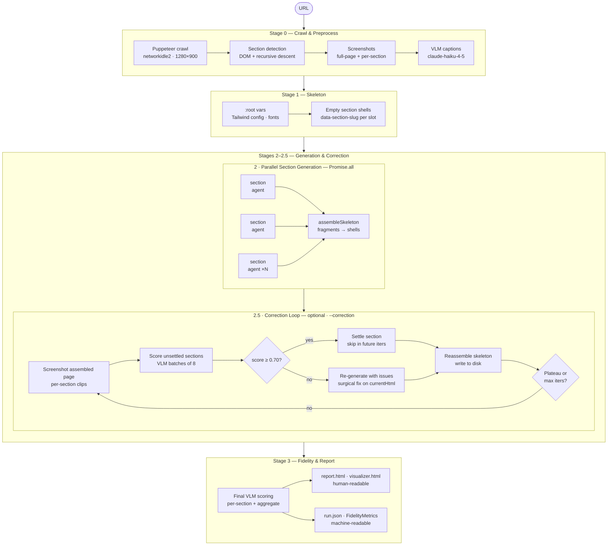

# Pipeline Overview

The pipeline transforms a public URL into a self-contained Tailwind CSS page through five sequential stages. Stages 0–2 are always active; Stages 2.5 and 3 are conditional.

---

## Stages

---

## Data contracts between stages

**Stage 0 → 1+2:** `CrawlResult` from `context.ts` — carries `html`, `screenshotBase64`, `visualArchDoc`, `sourceSectionScreenshots`, `computedStyles`, `fontFamilies`, `imageUrls`, `svgs`, and `fixedElementsHtml`.

**Stage 1 → 2:** Skeleton HTML string. Each section slot is a shell element tagged with `data-section-slug="<slug>"` and `data-section-order="<N>"`. A `:root` CSS custom-property block encodes brand colours and fonts for section agents to inherit.

**Stage 2 → 2.5/3:** `fragmentMap` — a `Map<slug, htmlFragment>` updated in-place by the correction loop. `assembleSkeleton` merges the current map into the skeleton on each write.

**Stage 3:** `FidelityMetrics` is attached to `RunRecord` and written to `run.json`.

---

## Model assignments

All model strings live in [`src/config.ts`](/config). No pipeline module contains a hardcoded model name.

| Stage | Model constant | Default |
|---|---|---|
| Skeleton | `MODELS.skeleton` | `claude-sonnet-4-6` |
| Section initial | `MODELS.sectionInitial` | `claude-sonnet-4-6` |
| Section correction | `MODELS.sectionCorrection` | `claude-haiku-4-5` |
| VLM scorer | `MODELS.vlmScorer` | `claude-sonnet-4-6` |
| Section captions | `MODELS.caption` | `claude-haiku-4-5` |
| Baseline | `MODELS.baseline` | `claude-haiku-4-5` |

---

## Module map

| File | Responsibility |
|---|---|
| `src/context.ts` | Stage 0 — Puppeteer crawl, section detection, VLM captions |
| `src/pipeline/skeleton-agent.ts` | Stage 1 — skeleton LLM call |
| `src/pipeline/section-agent.ts` | Stage 2 — per-section LLM call |
| `src/pipeline/assembly.ts` | Fragment injection, neighbour context, CSS var extraction |
| `src/pipeline/correction-loop.ts` | Stage 2.5 — scoring and re-generation loop |
| `src/pipeline/baseline-agent.ts` | Optional single-pass baseline (Haiku) |
| `src/observability/fidelity.ts` | Stage 3 — VLM section scoring + final metrics |
| `src/observability/metrics.ts` | Cost accounting, `estimateMaxTokens` |
| `src/observability/recorder.ts` | NDJSON stream + `run.json` / `summary.json` writer |
| `src/observability/logger.ts` | Typed phase event emitter + terminal formatter |
| `src/observability/report.ts` | HTML report generation |
| `src/config.ts` | Model names and quality budgets |
| `src/image.ts` | `resizeForVlm` — 1024px JPEG resize for all VLM calls |
| `src/utils.ts` | `slugify`, `urlSlug`, `escHtml` |
